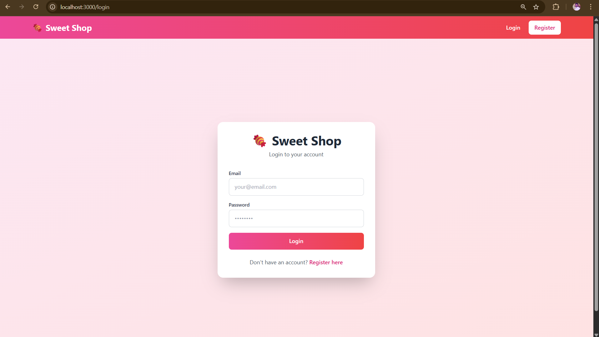
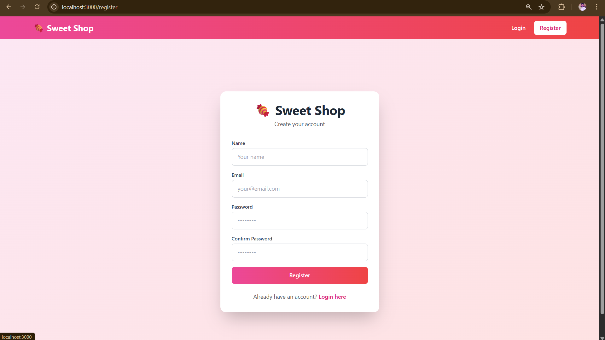
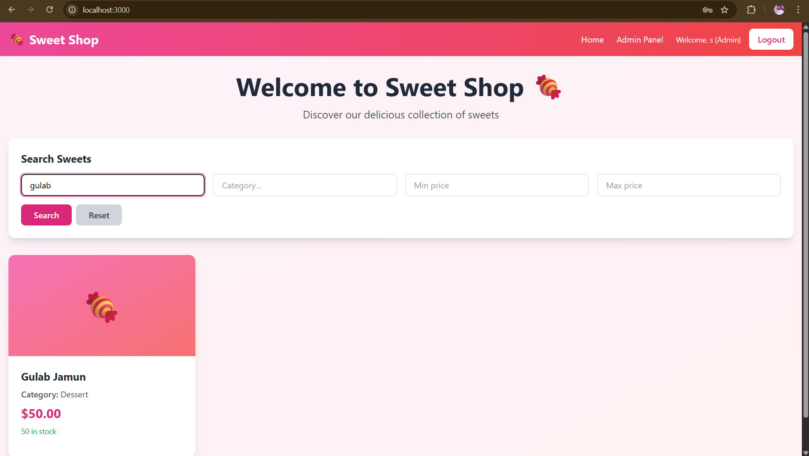
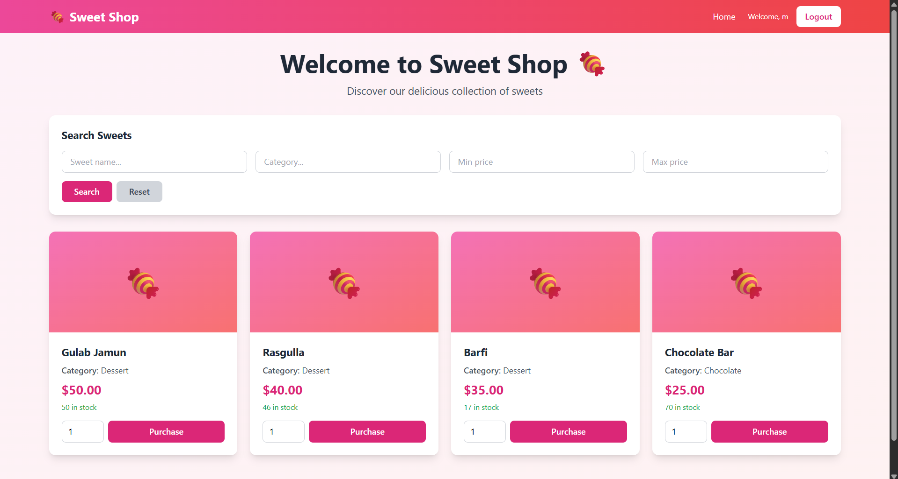
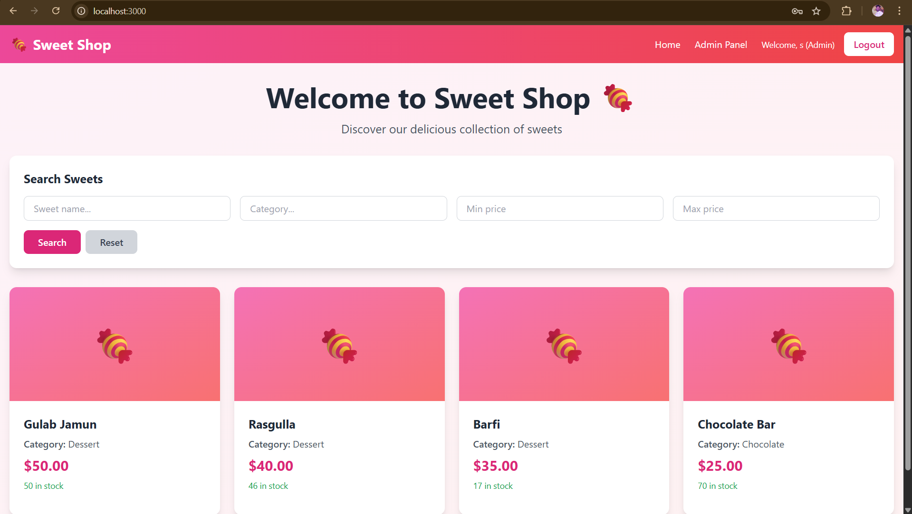
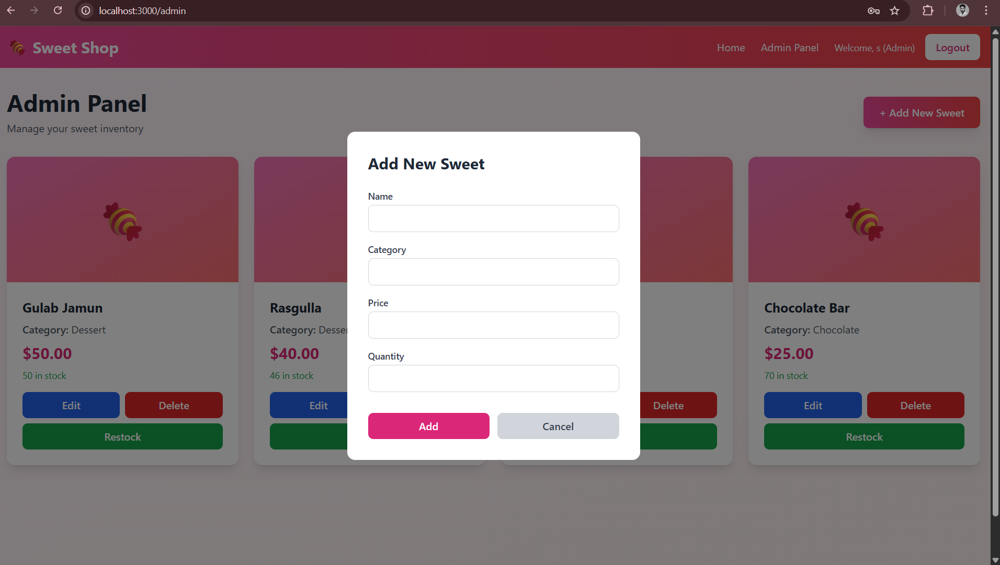
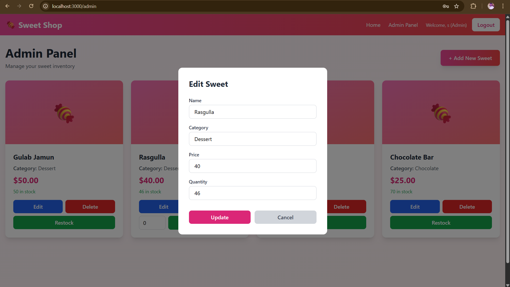
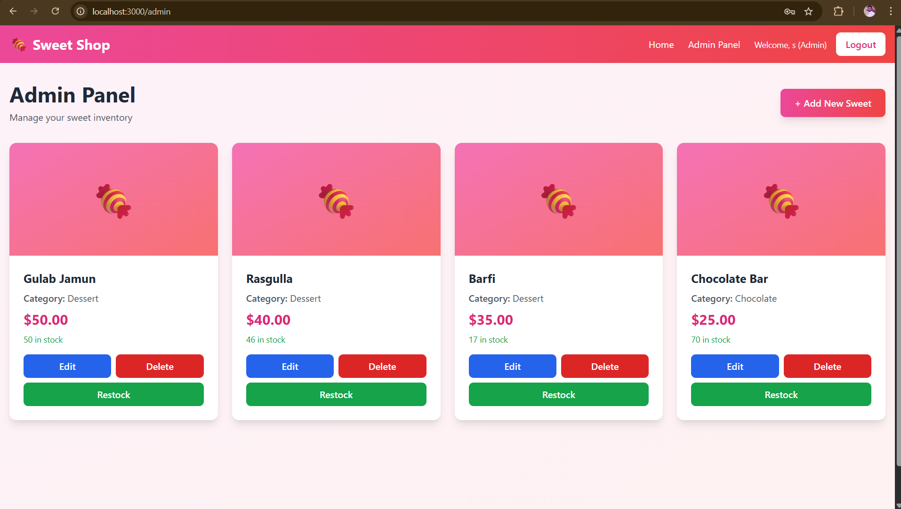

# 🍬 Sweet Shop Management System

A full-stack web application for managing a sweet shop inventory with user authentication, role-based access control, and real-time inventory management.

## 📋 Table of Contents

- [Project Overview](#project-overview)
- [Features](#features)
- [Technology Stack](#technology-stack)
- [Project Structure](#project-structure)
- [Prerequisites](#prerequisites)
- [Installation & Setup](#installation--setup)
- [Running the Application](#running-the-application)
- [API Documentation](#api-documentation)
- [Screenshots](#screenshots)
- [My AI Usage](#my-ai-usage)
- [Testing](#testing)
- [Deployment](#deployment)

## 🎯 Project Overview

The Sweet Shop Management System is a modern web application designed to streamline the management of a sweet shop's inventory. It provides a user-friendly interface for customers to browse and purchase sweets, while offering administrators powerful tools to manage inventory, add new products, and track stock levels.

### Key Highlights

- **Secure Authentication**: JWT-based authentication with role-based access control
- **Real-time Updates**: Instant inventory updates when purchases are made
- **Responsive Design**: Beautiful, mobile-friendly interface built with Tailwind CSS
- **Admin Dashboard**: Comprehensive inventory management tools for administrators
- **Search & Filter**: Advanced search functionality to find sweets by name, category, or price
- **Automatic Token Refresh**: Seamless user experience with automatic session management

## ✨ Features

### For Customers (USER Role)
- 🔐 User registration and login
- 🍭 Browse all available sweets
- 🔍 Search and filter sweets by name, category, and price range
- 🛒 Purchase sweets with real-time inventory updates
- 📊 View current stock levels
- 🔄 Automatic session management

### For Administrators (ADMIN Role)
- 👥 All customer features
- ➕ Add new sweets to inventory
- ✏️ Edit existing sweet details
- 🗑️ Delete sweets from inventory
- 📦 Restock inventory with custom quantities
- 🎛️ Dedicated admin panel for management

## 🛠️ Technology Stack

### Backend
- **Java 21** - Programming language
- **Spring Boot 3.5.7** - Application framework
- **Spring Security** - Authentication and authorization
- **Spring Data JPA** - Database operations
- **MySQL 8.0** - Relational database
- **JWT (JSON Web Tokens)** - Token-based authentication
- **Lombok** - Reduce boilerplate code
- **Maven** - Build and dependency management

### Frontend
- **React 18** - UI library
- **JavaScript (ES6+)** - Programming language
- **Vite** - Build tool and dev server
- **Tailwind CSS** - Utility-first CSS framework
- **React Router** - Client-side routing
- **Axios** - HTTP client for API calls
- **Context API** - State management

## 📁 Project Structure

```
sweet-shop-management-system/
├── sweet-shop-server/          # Spring Boot Backend
│   ├── src/
│   │   ├── main/
│   │   │   ├── java/
│   │   │   │   └── com/sweet_shop_server/
│   │   │   │       ├── controller/      # REST controllers
│   │   │   │       ├── service/         # Business logic
│   │   │   │       ├── repository/      # Data access
│   │   │   │       ├── entity/          # JPA entities
│   │   │   │       ├── dto/             # Data transfer objects
│   │   │   │       ├── security/        # JWT & security config
│   │   │   │       └── configuration/   # App configuration
│   │   │   └── resources/
│   │   │       └── application.properties
│   │   └── test/                        # Unit tests
│   └── pom.xml
│
├── sweet-shop-client/          # React Frontend
│   ├── src/
│   │   ├── components/         # Reusable UI components
│   │   ├── pages/              # Page components
│   │   ├── services/           # API services
│   │   ├── hooks/              # Custom React hooks
│   │   ├── context/            # React context
│   │   ├── App.jsx             # Main app component
│   │   └── main.jsx            # Entry point
│   ├── public/                 # Static assets
│   └── package.json
│
├── BACKEND_SETUP.md            # Backend setup guide
├── FRONTEND_SETUP.md           # Frontend setup guide
└── README.md                   # This file
```

## 📦 Prerequisites

Before you begin, ensure you have the following installed:

### Backend Requirements
- **Java Development Kit (JDK) 21** or higher
- **Maven 3.6+** for building the project
- **MySQL 8.0+** for the database
- **IDE** (IntelliJ IDEA, Eclipse, or VS Code recommended)

### Frontend Requirements
- **Node.js 18+** and npm
- **Modern web browser** (Chrome, Firefox, Safari, or Edge)

## 🚀 Installation & Setup

### Step 1: Clone the Repository

```bash
git clone https://github.com/yourusername/sweet-shop-management-system.git
cd sweet-shop-management-system
```

### Step 2: Setup Backend

#### 2.1 Configure MySQL Database

```sql
-- Connect to MySQL
mysql -u root -p

-- Create database
CREATE DATABASE sweetshop;

-- Exit MySQL
EXIT;
```

#### 2.2 Configure Application Properties

Edit `sweet-shop-server/src/main/resources/application.properties`:

```properties
# Server Configuration
server.port=8050

# JWT Secret Key (Change this in production!)
jwt.secretKey=your-super-secure-secret-key-here

# MySQL Configuration
spring.datasource.url=jdbc:mysql://localhost:3306/sweetshop?useSSL=false&serverTimezone=UTC
spring.datasource.username=root
spring.datasource.password=your_mysql_password

# JPA Configuration
spring.jpa.hibernate.ddl-auto=update
spring.jpa.show-sql=true
spring.jpa.properties.hibernate.dialect=org.hibernate.dialect.MySQL8Dialect
```

#### 2.3 Build and Run Backend

```bash
cd sweet-shop-server
mvn clean install
mvn spring-boot:run
```

The backend will start on `http://localhost:8050`

### Step 3: Setup Frontend

#### 3.1 Install Dependencies

```bash
cd sweet-shop-client
npm install
```

#### 3.2 Run Development Server

```bash
npm run dev
```

The frontend will start on `http://localhost:3000`

## 🎮 Running the Application

### Quick Start

1. **Start MySQL** (if not already running)
   ```bash
   # On Linux/Mac
   sudo systemctl start mysql
   
   # On Windows
   net start MySQL80
   ```

2. **Start Backend**
   ```bash
   cd sweet-shop-server
   mvn spring-boot:run
   ```

3. **Start Frontend** (in a new terminal)
   ```bash
   cd sweet-shop-client
   npm run dev
   ```

4. **Access the Application**
   - Open your browser and navigate to `http://localhost:3000`
   - Register a new account
   - Start browsing sweets!

### Creating an Admin Account

By default, all users register as customers. To create an admin account:

1. Register a user through the application
2. Update the user's role in the database:
   ```sql
   USE sweetshop;
   UPDATE users SET role = 'ADMIN' WHERE email = 'admin@example.com';
   ```
3. Logout and login again
4. You'll now see the "Admin Panel" link in the navbar

For detailed setup instructions, see:
- [Backend Setup Guide](BACKEND_SETUP.md)
- [Frontend Setup Guide](FRONTEND_SETUP.md)
- [Admin Setup Guide](sweet-shop-client/ADMIN_SETUP.md)

## 📚 API Documentation

### Authentication Endpoints

| Method | Endpoint | Description | Auth Required |
|--------|----------|-------------|---------------|
| POST | `/api/auth/register` | Register new user | No |
| POST | `/api/auth/login` | Login user | No |
| POST | `/api/auth/refresh` | Refresh access token | Yes (Cookie) |

### Sweet Management Endpoints

| Method | Endpoint | Description | Auth Required | Admin Only |
|--------|----------|-------------|---------------|------------|
| GET | `/api/sweets` | Get all sweets | Yes | No |
| GET | `/api/sweets/search` | Search sweets | Yes | No |
| POST | `/api/sweets` | Add new sweet | Yes | No |
| PUT | `/api/sweets/{id}` | Update sweet | Yes | No |
| DELETE | `/api/{id}` | Delete sweet | Yes | Yes |

### Inventory Management Endpoints

| Method | Endpoint | Description | Auth Required | Admin Only |
|--------|----------|-------------|---------------|------------|
| POST | `/sweets/{id}/purchase` | Purchase sweet | Yes | No |
| POST | `/sweets/{id}/restock` | Restock sweet | Yes | Yes |

### Example API Requests

#### Register User
```bash
curl -X POST http://localhost:8050/api/auth/register \
  -H "Content-Type: application/json" \
  -d '{
    "name": "John Doe",
    "email": "john@example.com",
    "password": "password123"
  }'
```

#### Login
```bash
curl -X POST http://localhost:8050/api/auth/login \
  -H "Content-Type: application/json" \
  -d '{
    "email": "john@example.com",
    "password": "password123"
  }'
```

#### Get All Sweets
```bash
curl -X GET http://localhost:8050/api/sweets \
  -H "Authorization: Bearer YOUR_ACCESS_TOKEN"
```

## 📸 Screenshots

<<<<<<< HEAD
### Login Page

*Secure login with JWT authentication*

### Register Page

*User-friendly registration form*

=======
>>>>>>> 183da403ab5617db9ec66909c5c429344eb5f932
### Search & Filter

*Advanced search functionality to find sweets by name, category, or price range*

### Purchase Flow

*Simple and intuitive purchase process with quantity selection*

### Admin Panel

*Comprehensive admin dashboard for inventory management*

### Add New Sweet

*Easy-to-use form for adding new sweets to inventory*

### Edit Sweet

*Update sweet details including name, category, price, and quantity*

### Restock Inventory

*Quick restock functionality with custom quantity input*

## 🤖 My AI Usage

### AI Tools Used

I extensively used **Kiro AI Assistant** throughout the development of this project to accelerate development while maintaining code quality and best practices.

### How I Used AI

#### 1. Project Architecture & Planning
- **Brainstorming**: Used AI to discuss and refine the overall architecture of the application
- **Technology Selection**: Consulted AI on choosing the right tech stack (Spring Boot + React + MySQL)
- **API Design**: Collaborated with AI to design RESTful API endpoints following best practices
- **Database Schema**: Discussed and refined the database structure for users and sweets tables

#### 2. Backend Development (Spring Boot)
- **Boilerplate Generation**: AI generated initial controller, service, and repository classes
- **Security Configuration**: AI helped implement JWT authentication and Spring Security configuration
- **Exception Handling**: Used AI to create global exception handlers and custom exceptions
- **CORS Configuration**: AI assisted in setting up proper CORS configuration for frontend integration
- **Token Refresh Logic**: Implemented cookie-based refresh token mechanism with AI guidance

**Example**: For the authentication system, I asked AI to generate the JWT service and security configuration, then manually customized the token expiry times and added refresh token functionality.

#### 3. Frontend Development (React)
- **Component Structure**: AI generated the initial structure for all React components
- **State Management**: Used AI to implement Context API for authentication state
- **API Integration**: AI helped create axios interceptors for automatic token refresh
- **Form Validation**: Implemented client-side validation with AI assistance
- **Responsive Design**: AI provided Tailwind CSS classes for responsive layouts
- **Custom Hooks**: Created useSweets hook with AI guidance for state management

**Example**: The automatic token refresh logic in the API interceptor was initially generated by AI, then I refined it to work with our cookie-based backend implementation.

#### 4. UI/UX Design
- **Component Design**: AI suggested component layouts and Tailwind CSS styling
- **Color Scheme**: Collaborated with AI to choose a pink/red gradient theme suitable for a sweet shop
- **User Flow**: Discussed and optimized user experience flows with AI
- **Accessibility**: AI helped ensure proper ARIA labels and keyboard navigation

#### 5. Testing & Debugging
- **Bug Identification**: Used AI to help identify and fix issues like:
  - JWT token decoding problems
  - Role-based access control bugs
  - API endpoint mismatches
  - Input field UX issues
- **Error Handling**: AI suggested comprehensive error handling strategies
- **Edge Cases**: Discussed potential edge cases and how to handle them

#### 6. Documentation
- **README Creation**: AI helped structure and write comprehensive documentation
- **Setup Guides**: Generated detailed setup instructions for both backend and frontend
- **API Documentation**: Created API endpoint documentation with AI assistance
- **Code Comments**: AI suggested meaningful comments for complex logic

### Specific Examples of AI Assistance

#### Example 1: Authentication Context
```javascript
// Initial AI-generated structure
const AuthContext = createContext(undefined);

export const AuthProvider = ({ children }) => {
  const [user, setUser] = useState(null);
  // ... AI generated boilerplate
};
```
I then manually added:
- JWT token decoding logic
- Role extraction from token payload
- Persistent authentication state

#### Example 2: Admin Panel Component
AI generated the basic structure with CRUD operations, and I customized:
- Error handling and user notifications
- Modal dialogs for add/edit operations
- Restock functionality with auto-focus input
- Responsive grid layout

#### Example 3: Security Implementation
AI helped identify a security vulnerability where users could self-register as admins. Together we:
- Removed the role selection from registration
- Implemented database-only admin creation
- Updated documentation with secure setup instructions

### Reflection on AI Impact

#### Positive Impacts

1. **Accelerated Development**: AI significantly reduced development time by generating boilerplate code and initial implementations. What might have taken days was accomplished in hours.

2. **Best Practices**: AI consistently suggested industry best practices for:
   - RESTful API design
   - Security implementations
   - Code organization and structure
   - Error handling patterns

3. **Learning Opportunity**: Working with AI helped me understand:
   - JWT authentication flows
   - React Context API patterns
   - Spring Security configuration
   - Modern frontend architecture

4. **Problem Solving**: When stuck on issues, AI provided multiple solution approaches, helping me choose the best one for my specific use case.

5. **Documentation**: AI made it easy to create comprehensive documentation, ensuring the project is well-documented and maintainable.

#### Challenges & Limitations

1. **Context Understanding**: Sometimes AI generated code that didn't perfectly match the backend implementation (e.g., refresh token endpoint structure), requiring manual adjustments.

2. **Over-Engineering**: Occasionally, AI suggested overly complex solutions when simpler ones would suffice. I had to evaluate and simplify.

3. **Testing**: While AI could generate test structures, I still needed to manually verify functionality and edge cases.

4. **Business Logic**: AI provided technical implementation, but I had to define the specific business requirements and user flows.

### My Development Workflow with AI

1. **Planning Phase**: Discussed requirements and architecture with AI
2. **Implementation**: AI generated initial code, I reviewed and customized
3. **Testing**: Unit tested functionality, used AI to debug issues
4. **Refinement**: Iteratively improved code with AI suggestions
5. **Documentation**: AI helped create comprehensive docs

### Key Takeaway

AI was an invaluable co-pilot throughout this project, but it was most effective when combined with:
- **Critical thinking** to evaluate AI suggestions
- **Domain knowledge** to guide AI in the right direction
- **Unit testing** to ensure everything works correctly
- **Code review** to maintain quality and consistency


### Manual Testing Checklist

- [ ] User registration works
- [ ] User login works
- [ ] JWT token is stored correctly
- [ ] Protected routes require authentication
- [ ] Admin routes require admin role
- [ ] Browse sweets displays all items
- [ ] Search functionality works
- [ ] Purchase decreases inventory
- [ ] Admin can add sweets
- [ ] Admin can edit sweets
- [ ] Admin can delete sweets
- [ ] Admin can restock inventory
- [ ] Token refresh works automatically
- [ ] Logout clears session


## 🤝 Contributing

Contributions are welcome! Please follow these steps:

1. Fork the repository
2. Create a feature branch (`git checkout -b feature/AmazingFeature`)
3. Commit your changes with AI co-authorship:
   ```bash
   git commit -m "feat: Add amazing feature
   
   
   Co-authored-by: Kiro AI Assistant <AI@users.noreply.github.com>"
   ```
4. Push to the branch (`git push origin feature/AmazingFeature`)
5. Open a Pull Request

## 📄 License

This project is licensed under the MIT License.

## 👥 Authors

- **Your Name** - *Initial work*
- **Kiro AI Assistant** - *AI Co-development*

## 🙏 Acknowledgments

- Spring Boot team for the excellent framework
- React team for the powerful UI library
- Tailwind CSS for the utility-first CSS framework
- Kiro AI for development assistance and guidance
- All open-source contributors whose libraries made this project possible

## 🔗 Links

- [Backend Setup Guide](BACKEND_SETUP.md)
- [Frontend Setup Guide](FRONTEND_SETUP.md)


---

**Note**: This project was developed as part of a TDD Kata exercise to demonstrate full-stack development skills with modern technologies and AI-assisted development practices.
